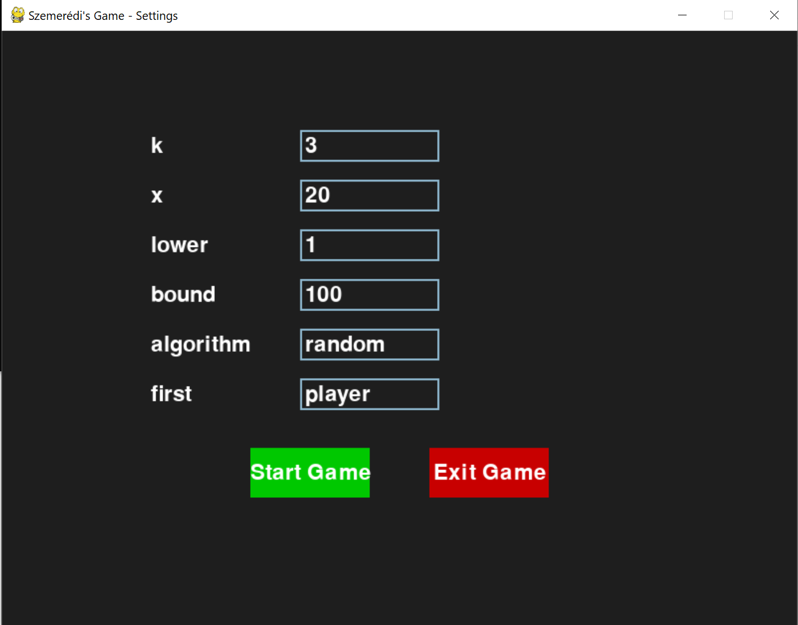
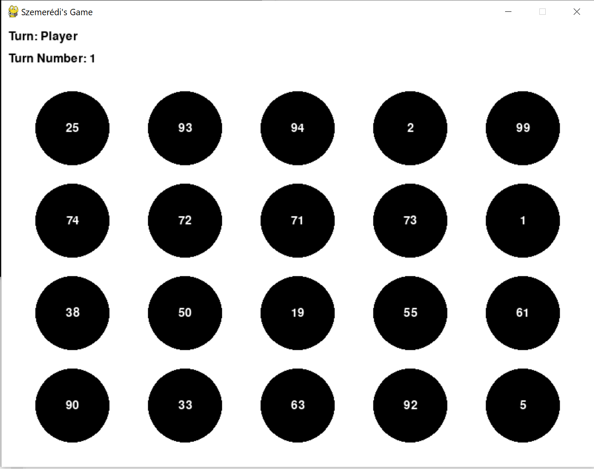
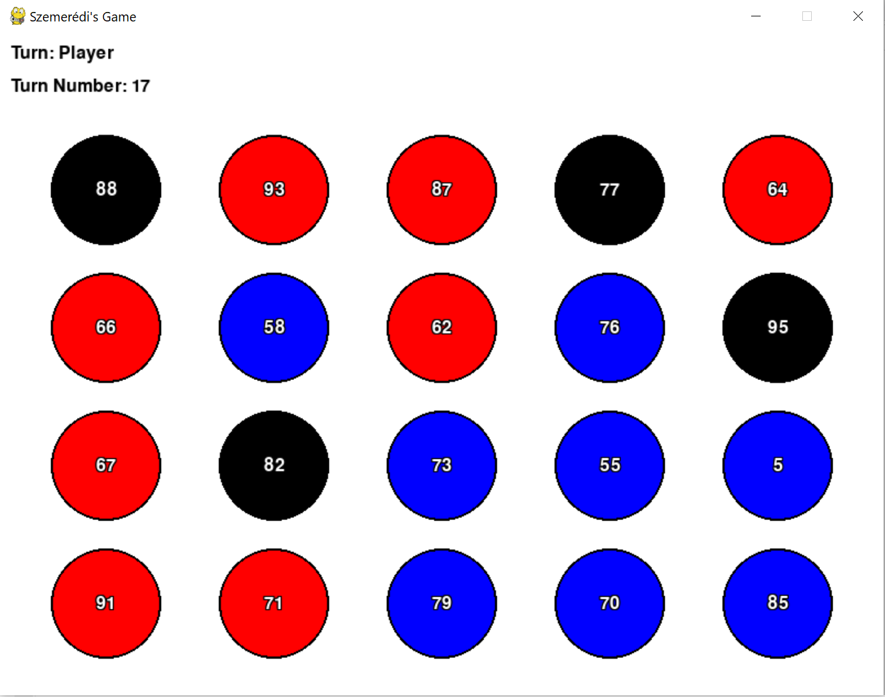

# Szemerédi's Game

## Description
Szemerédi's Game is a strategic game based on arithmetic progressions. The game takes two natural number inputs:
- **k**: the length of the arithmetic progression that players must form.
- **x**: the number of natural numbers that will be used to form a set X.

At the start of the game, the computer randomly generates a set X containing x natural numbers. Each player is assigned a unique color, and on each turn, a player selects an uncolored number from X and colors it with their own color. The objective is to be the first to form a monochromatic arithmetic progression of length k.

This version of the game is designed for human versus computer play.

## How to Play
1. **Main Menu & Settings**: 
   - Adjust the game settings:
     - **k**: Specify the required length of the arithmetic progression.
     - **x**: Define the size of the set X (the total number of available numbers).
     - **Lower & Bound**: Set the lower and upper limits of the natural numbers from which X is generated (it is going to be drawn from the set [lower_bound, upper_bound] of natural numbers).
     - **Algorithm**: Choose the computer's playing algorithm.
     - **First**: Decide who starts the game (player or computer).
2. **Gameplay**:
   - The set X is displayed on the screen as circles arranged in a grid. All circles start uncolored.
   - The player makes a move by clicking on an uncolored circle, which then turns blue.
   - The computer then makes its move by coloring one of the remaining circles red.
   - The game continues until one player exactly forms the forced winning arithmetic progression or until it becomes impossible to achieve it.
3. **End of Game**:
   - When a player’s selected numbers exactly match any existing arithmetic progression, that player wins.
   - If a player's selections exceed k without matching the forced progression, or if all circles are colored without forming any progression, the game ends in a draw.

## Winning Conditions
- A player wins if the set of numbers they have selected is exactly the same as any winning arithmetic progression (there is always at least one such progression).

## Draw Conditions
- The game is declared a draw if:
  - A player's number of selections exceeds k without forming the forced winning progression.
  - All numbers have been colored and no player has exactly formed the forced winning progression.

## Running the game
Game can be run two-fold:
- Through python directly
- Through a compiled executable file

In the following sub-sections we will describe the two approaches.  

### Running the game through python
If one wishes to run the game through python, the following steps should be followed:
1. Create a virtual environment: `py -3.10 -m venv myevn`.  
2. Then, activate the environment: `.\myenv\Scripts\activate`.
3. Install all requirements: `pip install -r requirements.txt`.
4. Run the game: `.\myvenv\Scripts\python .\main.py`.

### Running the game through executable file
The game has also been compiled into an .exe file! Follow the steps to run the game:
1. Go to into the directory `dist/szemeredi_game/`.
2. Run the file `szemeredi_game.exe`.
3. Game should start.
4. Should the game not start, please recompile it locally by running `pyinstaller szemeredi_game.spec` through the virtual environment descibed in the [running-the-game-through-python] section.

## Developing the game
If one wishes to develop the game, they are free to do so!  
Nonetheless, the game has been designed to easily add computer strategies.  
To add another computer algorithm one should follow the subsequent steps:  
1. Add a function in the `algorithms/algorithms.py` directory describing a playing strategy.  
2. Add a (pre-made) decorator to the previously mentioned function `@register_algorithm("Name")` with its given `Name`.  
3. Run the game through python. The game should automatically find a new algorithm through `@register_algorithm` decorator.  
4. Run `pyinstaller szemeredi_game.spec` to generate a new .exe file after making changes (user may be asked by terminal to agree to replace the old files, type `y` and the generation will proceed).
5. Add files, commit and push onto a branch.

### Pyinstaller spec file
The `szemeredi_game.spec` file contains the specifications to compile the scripts into a executable file. Please don't touch anything there...

Enjoy playing Szemerédi's Game :D!
